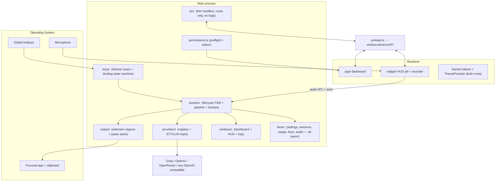
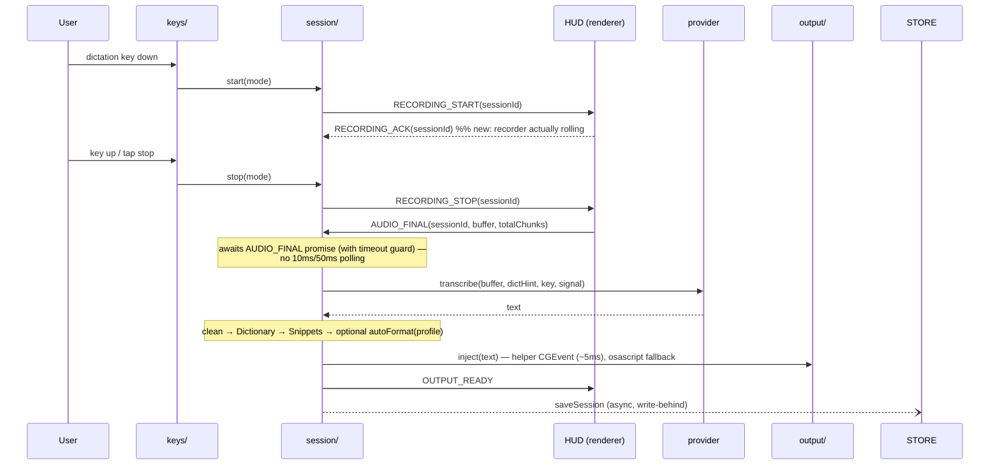

# Maverick Voice v2 — System Design & Architecture

HLD + LLD for the v2 rewrite. Companion docs: [`PRD.md`](./PRD.md) (product),
[`INTERFACES.md`](./INTERFACES.md) (authoritative module contract),
[`DESIGN.md`](./DESIGN.md) (UI/theme), [`LEGACY-ISSUES.md`](./LEGACY-ISSUES.md)
(v1 defects this design exists to not repeat). If this file disagrees with
`INTERFACES.md`, `shared/types.ts`, or `shared/ipc.ts`, those win.

The v1 code in `legacy/` is **reference only** — port semantics and tuned
constants, never structure.

---

## 1. Overview

Electron app, three contexts (unchanged topology from v1):

- **Main process** (Node) — engine: key listening, session pipeline, provider
  calls, output injection, persistence, tray, windows.
- **Preload** — context-isolated `contextBridge` exposing exactly `ElectronAPI`.
- **Renderer** (React 19) — two roots by URL hash: dashboard (Home / History /
  Dictionary / Snippets / Settings) and the HUD pill (`#/widget`).

### 1.1 Design tenets (each answers a v1 failure)

| Tenet | v1 failure it prevents |
|---|---|
| **Universal by construction** — every shipped binary is fat (arm64+x64) or arch-neutral; CI asserts it. | arm64-only DMG, host-arch swiftc, host-arch native rebuilds (LEGACY-ISSUES §1) |
| **Nothing blocks the hot path** — keypress→record and stop→paste touch zero sync fs/DB/spawn work; persistence is write-behind. | sync writes + prune scans per chunk, sync SQLite in the paste animation (§2) |
| **Events, not sleeps** — every cross-process handoff is an explicit ack; timers only for UX timing (auto-hide, undo window), never for correctness. | 3 grace polls, sleep(150), 220 ms cross-process coupling (§2, §3) |
| **Fail loudly** — permissions and hotkey capability are preflighted and surfaced; no silent no-op paths. | dead hotkeys on missing TCC / non-Apple keyboards (§1) |
| **One owner per concern** — key bindings, HUD visibility timers, timeout policy each live in exactly one module. | dual key-config plumbing, double cancelPendingHide, 4× timeout constants (§4) |
| **Atomic modules** — no file > ~400 lines; god classes split along seams below. | 1,492-line sessionManager, 940-line main.ts, 1,257-line Settings.tsx |

---

## 2. Requirements

### 2.1 Functional
FR1–FR17 from v1 carry over (hotkeys, recording, pluggable STT/LLM, selection
capture, output injection, chaining, cancel/undo, activation modes, history +
retry, usage cost, encrypted keys, settings, permissions, Dictionary/Snippets,
auto-format, app profiles, combo bindings). New:

| ID | Requirement |
|----|-------------|
| FR18 | Universal macOS binary; minimum macOS 12; Windows 10/11 x64; Linux x64 (AppImage + deb — X11 full parity, Wayland graceful degradation per FR24). |
| FR19 | Permission preflight (`AXIsProcessTrusted`, `IOHIDCheckAccess`, mic, Automation) with actionable UI; hotkey capability detection (Fn availability, Globe conflicts). |
| FR20 | Theme system: light/dark/system tokens applied to both roots. |
| FR21 | HUD positions on the display containing the cursor. |
| FR22 | Preload subscriptions return unsubscribe functions (no `removeAllListeners`). |
| FR23 | Auto-update via generic R2 feed with version guard. |
| FR24 | Linux session-type detection (X11 vs Wayland) at boot; on Wayland, paste injection degrades to copy-to-clipboard with explicit UI messaging; missing `xdotool`/secret-service detected and surfaced. |

### 2.2 Non-functional

| ID | Requirement |
|----|-------------|
| NFR1 | Dictation speak-stop → paste < 2 s p50; keypress → recording < 100 ms. |
| NFR2 | 60 fps HUD; animations compositor-only; zero main-process stalls > 16 ms on hot path. |
| NFR3 | Privacy: egress only to configured providers; **no transcript text in logs**. |
| NFR4 | Keys encrypted via `safeStorage` (Keychain/DPAPI). |
| NFR5 | New provider = one file + one registry line. |
| NFR6 | Platform seams isolated to `keys/`, `output/`, `windows/` modules. |
| NFR7 | Per-request timeouts + AbortController cancellation defined in ONE place; failures degrade to fallback paste, HUD never hangs. |
| NFR8 | Audio scratch pruned off-path (idle), 24 h / newest-100 / max-5 audio sets. |
| NFR9 | No source file > ~400 lines; no dead code shipped. |

---

## 3. High-Level Design

### 3.1 Component diagram



### 3.2 Session sequence (event-driven — the v1 poll loops are gone)



Chain-expiry, cancel-with-undo, too-short discard, and fallback-on-LLM-failure
flows carry over from v1 semantically; every "wait for X" is a promise resolved
by the corresponding IPC message, with a single timeout guard, instead of a
poll loop.

---

## 4. Low-Level Design

### 4.1 Main-process module map

The 1,492-line v1 `sessionManager` splits along its natural seams; `main.ts`
becomes a boot file only. Full signatures live in `INTERFACES.md`.

| Module | Responsibility (single) | Replaces (v1) |
|--------|------------------------|----------------|
| `electron/main.ts` | Boot order + wiring only (~100 lines): init store → windows → tray → keys → ipc. | 940-line main.ts |
| `electron/ipc/` (one file per domain: `session.ts`, `settings.ts`, `keys.ts`, `usage.ts`, `permissions.ts`) | Register handlers; route to modules. Zero business logic. | inline ~60 handlers |
| `electron/session/fsm.ts` | Session lifecycle state machine (idle→recording→awaiting-audio→processing→output/fallback/error/cancelled), undo-cancel, chain window arbitration. Emits typed events. | sessionManager (state) |
| `electron/session/pipeline.ts` | stop→paste pipeline: transcribe (parallel chunks, **all under the session AbortController**), stitch, route by flow type, LLM transform / auto-format, fallback. One timeout policy imported from `config.ts`. | sessionManager (373-line processSession) |
| `electron/session/textops.ts` | Pure functions: `cleanTranscript`, `applyDictionary`, `applySnippets`, `buildSttPromptHint`, `isLLMRefusal` (anchored, tested — v1's false-positive regex fixed), junk guard. | scattered in sessionManager |
| `electron/session/flows.ts` | `determineFlowType` + selection-role logic. Selection is captured **into the session object that requested it** (closure, not `this.currentSession`). Pre-existing selection no longer hijacks dictation into `quote`. | sessionManager |
| `electron/keys/listener.ts` | **Platform seam.** darwin: spawn `mac-helper`; win32 + linux: uiohook-napi. Emits normalized `KeyEvent`s. Line-buffered stdout parsing with partial-line carry; request/response correlation ids; restart with backoff + resettable latch. | keyListener.ts |
| `electron/keys/bindings.ts` | **Single owner of key-binding state** (dictation key/combo, instruction key, activation mode). The activation/chain/debounce FSM (constants preserved: 300/2000/400/400 ms; debounce gates START never STOP; `resetState()` discipline). | keyboard.ts + duplicated state in keyListener |
| `electron/keys/capability.ts` | Fn/Globe availability detection, Globe-conflict detection, per-platform default binding. | (new — fixes M5) |
| `electron/permissions.ts` | Preflight + live status: mic, Accessibility (`AXIsProcessTrusted`), Input Monitoring (`IOHIDCheckAccess` via helper), Automation. Ventura+ Settings deep links. win32 → granted/no-op. | scattered, incomplete |
| `electron/output/inject.ts` | Clipboard write + paste keystroke. darwin: helper `PASTE` command (CGEvent, acked, ~5 ms) with osascript fallback; win32: PowerShell SendKeys; linux: `xdotool` (X11) or copy-only degradation (Wayland). Clipboard save/restore preserves formats where API allows. | clipboard.ts |
| `electron/output/selection.ts` | Selection capture (copy round-trip) with per-session binding and event-acked settle (fallback timer as guard only). | clipboard.ts |
| `electron/windows/dashboard.ts` / `windows/hud.ts` | Window creation + HUD show/hide. **HUD visibility timing owned here alone**; renderer drives exit via a `HUD_EXIT_DONE` ack, not a hand-tuned 220 ms timer. HUD targets `screen.getDisplayNearestPoint(screen.getCursorScreenPoint())`. | windowManager.ts |
| `electron/windows/tray.ts` | Tray glyph + recording pulse (pre-rendered frames, generated once). | tray.ts |
| `electron/store/settings.ts` | electron-store schema + migrations (v1 `right-shift`→`caps-lock`, `dictationKey`→binding kept). | main.ts blob |
| `electron/store/sessions.ts` | Session history, **JSON file, async atomic write-behind** (tmp+rename), in-memory cache, cap 100 / 24 h pruning on idle. | db.ts (better-sqlite3) |
| `electron/store/usage.ts` | `usage_daily`-equivalent rows in JSON; additive upserts in memory, debounced flush; dollars computed at read from `PRICING`. | db.ts + usageTracker.ts |
| `electron/store/keys.ts` | `safeStorage` per-provider vault + dev-only `.env` seed (gated `!app.isPackaged`). | keyStore.ts |
| `electron/store/audio.ts` | Audio scratch: buffers held in memory during recording, **one async write at stop**, pruning scheduled on idle (never inline with a save). | audio.ts |
| `electron/providers/types.ts` | `TranscriptionProvider` / `LLMProvider` interfaces + `NoApiKeyError` (unchanged invariants). | same |
| `electron/providers/registry.ts` | `Map<id, provider>`. | same |
| `electron/providers/openaiCompatible.ts` | **Factory** producing an `LLMProvider` from `{id, label, baseUrl, models, headers?}` — one implementation of complete/testKey/timeout/agent. | ~450 duplicated lines across 3 files |
| `electron/providers/llm/openai.ts`, `llm/openrouter.ts` | One-line factory instantiations (+ OpenRouter headers). | full files |
| `electron/providers/stt/groq.ts` | Groq Whisper multipart (verbose_json, no arbitrary prompt — dictionary hint only), keep-alive Agent. | same, cleaned |
| `electron/prompts/` | System prompts + `buildAutoFormatPrompt(profile)` + `appProfiles.ts` detection table (ported verbatim — tuned). | prompts.ts, appProfiles.ts |
| `electron/updater.ts` | electron-updater against the real R2 feed; version guard. | placeholder URL |
| `electron/errors.ts` | `simplifyError` keyword map + in-memory ring; broadcasts to **both** windows. Log discipline: session ids and stage names only, never transcript text. | errorUtils + errorLogger |

**Deleted, never ported:** `ffmpeg.ts` + `ffmpeg-static` dep, `key-poster`
(swift + script + binary), `Usage/Privacy/Voice.tsx` dead views,
`setChainWindow`, `getRecentErrors` IPC-less export, unused registry listers.

### 4.2 Persistence: JSON instead of SQLite

v1 used better-sqlite3 for two tiny tables (sessions capped at 100 rows,
`usage_daily` a few rows/day) — paying for it with a native module (arch
landmine M3, postinstall rebuild fragility) and synchronous queries on the hot
path (C9). v2 stores both as JSON files in `userData/`:

- `sessions.json` — array, cap 100, atomic tmp+rename writes, write-behind
  (debounced ~500 ms, flushed on quit).
- `usage.json` — `{date → {model → {sttSeconds, inputTokens, outputTokens}}}`,
  additive in memory, debounced flush. Never pruned. Dollars computed at read.

No native module, no rebuild, no arch problem, no sync I/O. If history ever
outgrows this (it can't at cap 100), `node:sqlite` is the upgrade path.

### 4.3 Session FSM

States and semantics match v1's diagram (Idle, Recording, Chained, Processing,
Output, Fallback, Error, TooShort, Cancelled with 3 s undo) with these
contract changes:

1. **`awaiting-audio` is explicit**: `stop()` transitions to a state that
   resolves on `AUDIO_FINAL`/`AUDIO_DISCARDED` (single timeout guard ~2 s),
   replacing all three v1 grace polls.
2. **AbortController created at session start**, so chunk transcriptions
   in flight are cancellable (v1 bug #2); a failed chunk marks the session
   `fallback` with a visible notice instead of a silent gap.
3. `isProcessing` still serializes the pipeline, but a keypress during
   processing shows a "still working / press Esc to cancel" HUD hint rather
   than a bare rejection.
4. Escape handling moves from `globalShortcut` to the key listener, active
   only while a session exists (v1 bug #11).
5. Retry (`session:retry`) writes results only on success; failures update
   status + error while preserving prior transcript/output (v1 bug #1).

### 4.4 Renderer

| Module | Notes |
|--------|-------|
| `renderer/main.tsx` | Hash route: `#/widget` → HUD root, else dashboard. Both wrapped in `ThemeProvider`. |
| `renderer/theme/` | `ThemeProvider` (light/dark/system via IPC-persisted setting + `matchMedia`), sets `data-theme` on `<html>`. Tokens live in CSS (`DESIGN.md`). |
| `renderer/ui/` | Shared primitives — `Toggle`, `Segmented`, `KeyCard`, `PageHeader`, `EmptyState`, `LoadingDots`, `ProviderGlyph`, `Kbd`, glyphs — one implementation each (v1 had 2–4 copies of most). Data modules: `languages.ts`, `keyLabels.ts`, `platform.ts`. |
| `renderer/app/App.tsx` | Shell + sidebar. **Tabs stay mounted** (hidden via CSS/`display`), killing the remount-per-click IPC storm (C5). Settings state loaded once, cached above tabs. |
| `renderer/app/settings/` | One file per section (Permissions, ProviderKeys, Shortcuts, Audio, Behavior, Appearance, Advanced, Help) composed by a thin `Settings.tsx`. |
| `renderer/app/{History,Dictionary,Snippets,Onboarding}/` | Ported flows; Dictionary/Snippets persist immediately on change with a flush-on-hide guard (v1 bug #13); onboarding steps data-driven with the shared `KeyCard`. |
| `renderer/widget/Widget.tsx` | **One persistent pill** that morphs between states (width/state transitions via transform/opacity on a stable DOM). Static stylesheet (no injected `<style>`). Timer text isolated in a memoized leaf. `aria-live="polite"` announcements. Exit completion reported via `HUD_EXIT_DONE` ack. |
| `renderer/widget/recorder.ts` | MediaRecorder + VAD/chunking engine with **one flush path** shared by chunk-emit and stop (v1 bugs #3/#4), stop promise with timeout guard, serialized start (in-flight start awaited before a new one). All tuned constants preserved (fftSize 128, RMS threshold, 250 ms timeslice, MIN_DURATION_MS 500, silence/hard-cap from `AppConfig.chunking`). |
| `renderer/widget/Waveform.tsx` | v1's rAF loop kept as-is (it was correct); color read at draw time (no rebuild on mode switch). |
| Sounds | One lazily created, reused `AudioContext`. Sound-feedback setting subscribed live. |

### 4.5 IPC

`shared/ipc.ts` remains the single source of channel names; `shared/types.ts`
the single source of shapes. v1's channel table carries over with these deltas:

- New: `RECORDING_ACK` (R→M), `HUD_EXIT_DONE` (R→M), `PERM_PREFLIGHT` (R↔M →
  `PermissionsReport`), `THEME_GET/SET` (R↔M / R→M), `KEY_CAPABILITY` (R↔M).
- Removed: none of the v1 surface users depend on; dead channels not ported.
- **Preload returns an unsubscribe function from every `on*` subscription**
  (FR22); renderer never calls `removeAllListeners`, and the raw-literal
  channel strings in renderer cleanup code disappear with them.
- Audio buffers cross IPC exactly once; main hands `Buffer` views to providers
  without re-copying.

### 4.6 Providers

Contract and invariants unchanged from v1 (caller injects keys; empty key →
`NoApiKeyError`; AbortError re-throws; usage recorded with exact model string;
canonical OpenAI-compatible body so any base URL plugs in). New-provider
recipe unchanged: file + registry line + id union + pricing rows. The
OpenAI-compatible factory means most LLM providers are ~10 lines.

---

## 5. Cross-platform seams

| Concern | macOS | Windows | Linux |
|---------|-------|---------|-------|
| Key listening | `mac-helper` (Swift, **universal lipo**, macOS 12 target): flagsChanged monitor → `FN_*`, `CAPS_*`, `RIGHT_OPTION_*`, `MODS:` tokens; stdin `PASTE`/`COPY`/`FRONTAPP`/`HEALTH` | uiohook-napi (by `UiohookKey` name, auto-repeat suppressed) | uiohook-napi (X11; on Wayland hooks may be compositor-blocked → preflight reports it) |
| Paste/copy | helper CGEvent (acked) → osascript fallback | clipboard + PowerShell `SendKeys` (`-NoProfile`) | clipboard + `xdotool key ctrl+v` (X11); Wayland → copy-to-clipboard mode + notice |
| Selection capture | osascript copy round-trip | SendKeys `^c` round-trip | `xdotool key ctrl+c` round-trip (X11); unavailable on Wayland → instruction mode requires clipboard fallback |
| Frontmost app | helper `FRONTAPP` / osascript | PowerShell P/Invoke | `xdotool getactivewindow` (X11); `null` on Wayland → `default` profile |
| Permissions | preflight via `AXIsProcessTrusted` / helper `HEALTH` / mic status; Ventura+ links | granted/no-op | preflight reports session type (X11/Wayland), `xdotool` presence, secret-service availability |
| Key storage | `safeStorage` → Keychain | `safeStorage` → DPAPI | `safeStorage` → libsecret; if backend is `basic_text`, warn before storing |
| HUD window | `type:'panel'`, all-workspaces, no shadow | frameless | frameless; transparency requires a compositor (detected, else opaque fallback) |
| Tray | template image | white-on-transparent | white-on-transparent (StatusNotifier/appindicator) |

`mac-helper` is v1's `globe-listener` protocol plus `HEALTH` (reports whether
its event monitor is actually receiving events → drives the permission
banner), built by `scripts/build-mac-helper.js`:
`swiftc -target arm64-apple-macos12` + `swiftc -target x86_64-apple-macos12`
+ `lipo -create`; the build **fails** if the output is not universal (no
mtime skip-with-stale-binary: script hashes source → rebuilds on change,
CI runs `lipo -archs` assertion).

---

## 6. Data model

### 6.1 `sessions.json` entry
```ts
{ id: string; createdAt: number;
  flowType: 'dictation'|'transform'|'quote'|'context'|'instruction';
  dictationTranscript?: string; instructionTranscript?: string;
  selectedText?: string; selectedTextRole?: 'quote'|'context';
  output?: string; audioRef?: string;
  status: 'done'|'error'; errorMessage?: string }
```
Retention: 24 h / newest 100, pruned on idle.

### 6.2 `usage.json`
`{ [date: 'YYYY-MM-DD']: { [model: string]: { sttSeconds, inputTokens, outputTokens } } }`
— raw units only; `getUsageSummary()` buckets today / month / all-time and
prices at read from `PRICING` (hardcoded estimates, documented drift).

### 6.3 Settings (electron-store)
v1 keys carried over: `widgetPosition`, `soundFeedback`, `chunkedTranscription`,
`outputMode`, `inputDeviceId`, `dictationBinding` (key or combo),
`instructionKey: 'caps-lock'`, `activationMode`, `sttSettings`, `llmSettings`,
`instructionEnabled` (false), `autoFormat` (false), `appAwareFormatting`
(true), `dictionary` ([]), `snippets` ([]). New: `theme: 'system'|'light'|'dark'`.
Migrations: import v1 store if present.

### 6.4 REST API routes
None — no backend. All "API" surface is the typed `ElectronAPI` bridge
(see `INTERFACES.md`) and outbound provider HTTPS calls.

---

## 7. Package dependencies

| Package | Why |
|---------|-----|
| `electron` (current stable) | shell, `safeStorage`, `systemPreferences` |
| `electron-vite` | main/preload/renderer build, HMR |
| `react` / `react-dom` 19 | renderer |
| `typescript` 5.x | shared contract |
| `tailwindcss` 4 + `@tailwindcss/vite` | utilities over intent tokens |
| `electron-store` | settings |
| `uiohook-napi` | key listener on **win32 + linux** (excluded from mac bundle) |
| `undici` | keep-alive HTTP agent |
| `uuid` | session ids |
| `electron-builder` | universal mac DMG + NSIS |
| `electron-updater` | R2 generic feed |

**Dropped from v1:** `better-sqlite3` (→ JSON store), `ffmpeg-static` (dead),
`@aws-sdk/client-s3` stays CI-only (release script), `@lobehub/icons` kept for
provider glyphs (mono variants only). Single lockfile: `package-lock.json`
(npm required by electron-builder; delete `bun.lock`).

---

## 8. Build, packaging, release

- **Targets:** mac `dmg` `arch: ["universal"]`, min macOS 12
  (`LSMinimumSystemVersion` pinned); win `nsis` x64; linux `AppImage` + `deb`
  x64 (built on Linux CI runner; `xdotool` listed as a deb recommends, and
  detected at runtime for AppImage users). |
- **Native:** only `mac-helper` (universal, checked) and uiohook-napi prebuilds
  (both darwin slices ship in-package; win32 prebuilt). No postinstall gyp
  rebuild required once better-sqlite3 is gone.
- **Signing:** hardened runtime + notarization ON (Developer ID R6G234T379);
  entitlements trimmed to `device.audio-input` + `automation.apple-events`
  (+ JIT if the runtime needs it) — drop `disable-library-validation`
  unless a dylib actually requires it.
- **CI:** release workflow asserts `lipo -archs` on app + helper before
  upload; updater manifest upload guarded (refuse if version ≤ published);
  `downloads.json` merged per-platform instead of last-writer-wins; local
  unsigned builds clearly named so they're never distributed.
- **Verification:** `npm run typecheck` (both tsconfigs) + `npm run build` in
  CI; never `npm run dev` headless.
