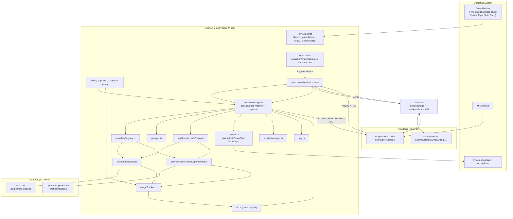
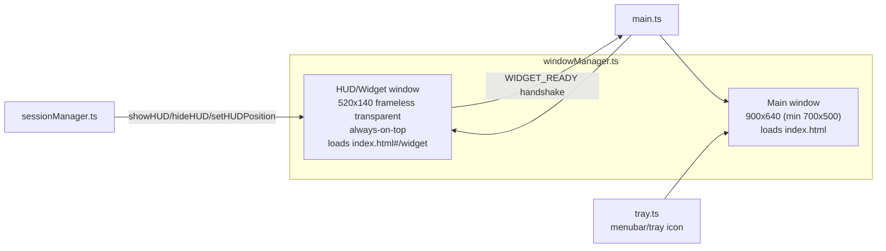
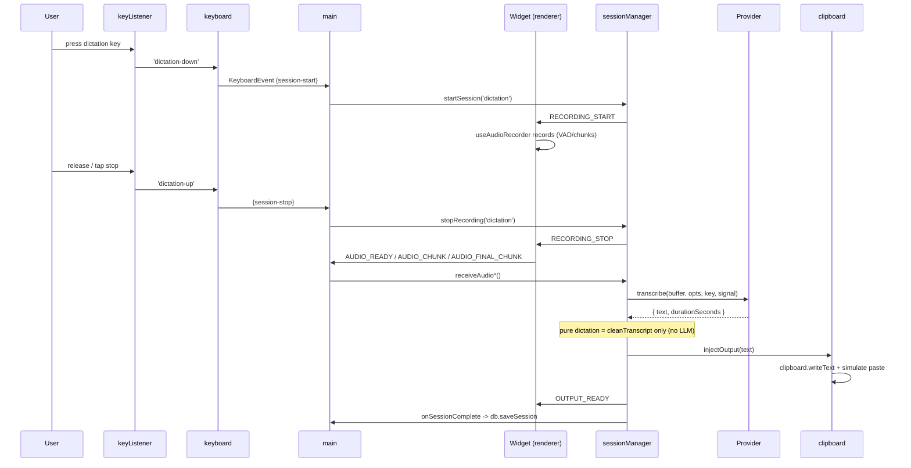
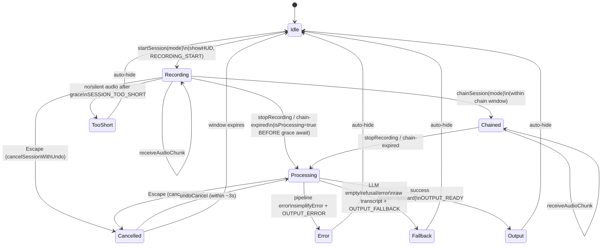
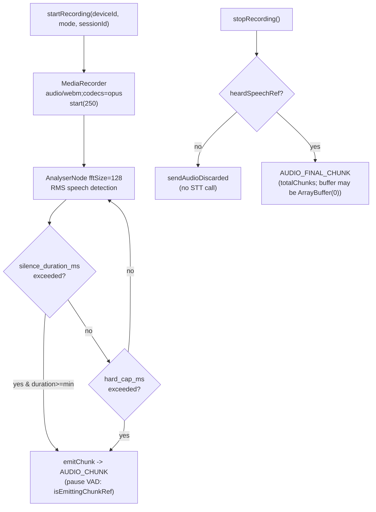
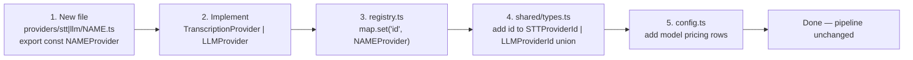

# Maverick Voice — System Design & Architecture

This document is the High-Level (HLD) and Low-Level (LLD) design for Maverick
Voice. It is derived from and stays consistent with the authoritative module
contract in [`INTERFACES.md`](./INTERFACES.md), the cross-process types in
[`shared/types.ts`](./shared/types.ts), and the IPC channel registry in
[`shared/ipc.ts`](./shared/ipc.ts). If anything here disagrees with those files,
those files win.

---

## 1. Overview

Maverick Voice is an Electron desktop app with three processes/contexts:

- **Main process** (Node) — the engine: key listening, session pipeline,
  provider calls, clipboard injection, persistence, tray, windows.
- **Preload** — a context-isolated `contextBridge` exposing exactly the
  `ElectronAPI` surface to the renderer.
- **Renderer** (React 19) — two roots routed by URL hash: the **main window**
  (history / features / settings / privacy) and the **HUD widget** pill.

It is **provider-agnostic** (STT and LLM behind interfaces + a registry),
**cross-platform** (macOS + Windows with platform seams), and **BYO-key**
(no backend; keys encrypted via OS keychain).

---

## 2. Requirements

### 2.1 Functional requirements

| ID | Requirement |
|----|-------------|
| FR1 | Capture global hotkeys for dictation and instruction on macOS and Windows. |
| FR2 | Record microphone audio in the renderer; stream it (whole or chunked) to main. |
| FR3 | Transcribe audio via a pluggable `TranscriptionProvider` (Groq Whisper v1). |
| FR4 | Lightly clean dictation transcripts in code (no LLM) for pure dictation. |
| FR5 | Capture the current text selection (clipboard round-trip) for instructions. |
| FR6 | Transform text via a pluggable `LLMProvider` (OpenAI/OpenRouter v1) on instruction. |
| FR7 | Deliver output to the cursor (paste) or clipboard, per output mode. |
| FR8 | Support dictation, instruction, and dictation→instruction chaining. |
| FR9 | Cancel (Escape) with a ~3s undo window; discard too-short/silent clips. |
| FR10 | Three activation modes (tap-toggle, push-to-talk, double-tap-push). |
| FR11 | Persist session history + usage in local SQLite; allow retry from saved audio. |
| FR12 | Estimate per-provider cost from local pricing tables. |
| FR13 | Store per-provider keys encrypted; validate against the provider. |
| FR14 | Configurable keys, models, base URL, language, widget position, sound. |
| FR15 | macOS permission flow; Windows resolves to granted/no-op. |

### 2.2 Non-functional requirements

| ID | Requirement |
|----|-------------|
| NFR1 | **Latency** — pure dictation speak-stop → paste < 2s p50 (no LLM hop). |
| NFR2 | **Reliability** — pipeline failures degrade to fallback paste; HUD never hangs. |
| NFR3 | **Privacy** — no backend, no telemetry; egress only to configured providers. |
| NFR4 | **Security** — keys encrypted at rest via Electron `safeStorage` (Keychain/DPAPI). |
| NFR5 | **Extensibility** — new provider = one file + one registry line; no pipeline change. |
| NFR6 | **Portability** — single codebase, platform seams isolated to `keyListener`/`clipboard`/`windowManager`/`tray`. |
| NFR7 | **Resilience** — per-request timeouts, AbortController cancellation, EPIPE guards, usage logging never breaks the pipeline. |
| NFR8 | **Resource hygiene** — audio scratch pruned (24h / newest 100 sessions / max 5 audio sets). |

---

## 3. High-Level Design (HLD)

### 3.1 Component diagram

### 3.2 Window / widget topology

- The **main window** hosts the React app shell (sidebar: History / Features /
  Settings / Privacy) and onboarding.
- The **HUD widget** is a frameless, transparent, always-on-top pill that
  floats over every app. `windowManager` gates `showHUD()` on a
  `WIDGET_READY` handshake from the renderer (`markHUDReady()` resolves the
  `hudReadyPromise`). `showHUD` calls `cancelPendingHide()` both before and
  after the readiness await; `hideHUD` defers teardown 220ms to let the exit
  animation (200ms) finish.
- Platform gating: macOS uses `type:'panel'`, `setVisibleOnAllWorkspaces`,
  `hiddenInset` title bar, `hasShadow:false`; Windows omits `type:'panel'` and
  uses a hidden/frameless title bar.

### 3.3 Process / data-flow summary

---

## 4. Low-Level Design (LLD)

### 4.1 Module map (from INTERFACES.md)

**Main-process modules**

| Module | Responsibility | Key exports |
|--------|----------------|-------------|
| `electron/main.ts` | Orchestration hub: boot order, IPC handlers, keyboard wiring, escape-owner machine, settings persistence, retry. | *(entry, no exports)* |
| `electron/config.ts` | Local-constant `AppConfig` + pricing tables (replaces Cloudflare ServerConfig). | `APP_CONFIG`, `REQUEST_TIMEOUT_MS`, `ModelPricing`, `STT_PRICING`, `LLM_PRICING`, `PRICING` |
| `electron/keyStore.ts` | Per-provider encrypted key vault + `.env` dev seed. | `getApiKey`, `hasApiKey`, `setApiKey`, `clearApiKey`, `getMaskedKey` |
| `electron/sessionManager.ts` | Core session state machine + sequential pipeline + chunk stitch + cancel/undo. | `cleanTranscript`, `sessionManager` |
| `electron/keyboard.ts` | Activation-mode + chaining + debounce state machine (platform-agnostic). | `KeyboardEvent`, `keyboardManager` |
| `electron/keyListener.ts` | **Platform seam.** Normalizes physical keys → logical `KeyEvent`s. | `KeyEvent`, `keyListener` |
| `electron/clipboard.ts` | Selection capture + paste injection (osascript / PowerShell). | `captureSelectedText`, `injectOutput`, `copyToClipboard` |
| `electron/windowManager.ts` | Main window + frameless HUD; show/hide/position + readiness handshake. | `createMainWindow`, `getMainWindow`, `getWidgetWindow`, `createHUDWindow`/`createWidgetWindow`, `setHUDPosition`, `showHUD`, `hideHUD`, `cancelPendingHide`, `markHUDReady`, `showMainWindow` |
| `electron/tray.ts` | Menubar/tray glyph + recording pulse animation. | `createTray`, `setTrayRecording`, `setTrayIdle`, `getTray` |
| `electron/db.ts` | `better-sqlite3` schema + CRUD for sessions + usage. | `initDB`, `addUsage`, `getUsageRows`, `clearUsage`, `saveSession`, `getSessions`, `getSession`, `updateSessionResult`, `deleteSession`, `clearAllSessions`, `closeDB`, `DBSession`, `UsageRow` |
| `electron/usageTracker.ts` | Cost estimation from pricing tables; raw-unit recording. | `recordSttUsage`, `recordLlmUsage`, `getUsageSummary`, `resetUsage` |
| `electron/audio.ts` | Audio scratch files (whole + chunked) + pruning. | `saveAudioFile`, `getAudioFilePath`, `loadAudioFile`, `deleteAudioFile`, `clearAllAudioFiles`, `saveAudioChunk` |
| `electron/ffmpeg.ts` | Resolve the bundled `ffmpeg-static` binary (asar-unpacked aware). | `getFFmpegPath` |
| `electron/prompts.ts` | Transform system prompts; assemble `{system, user, temperature}`. | `AssembledMessages`, `FlowType`, `assembleTransformMessages` |
| `electron/errorUtils.ts` | Keyword-mapped, BYO-key-tuned error copy. | `simplifyError` |
| `electron/errorLogger.ts` | In-memory error ring → Developer view via IPC. | `ErrorEntry`, `initErrorLogger`, `broadcastError`, `getRecentErrors` |
| `electron/preload.ts` | `contextBridge` implementation of `ElectronAPI`. | *(bridge)* |
| `electron/providers/types.ts` | Provider-agnostic interfaces + registry types + `NoApiKeyError`. | `TranscriptionProvider`, `LLMProvider`, `TranscribeOptions/Result`, `CompleteOptions/Result`, `KeyTestResult`, `ProviderRegistry`, `NoApiKeyError` |
| `electron/providers/registry.ts` | `Map<id, provider>`; lookup + enumeration. | `registry`, `getTranscriptionProvider`, `getLLMProvider`, `listTranscriptionProviders`, `listLLMProviders` |
| `electron/providers/stt/groq.ts` | Groq Whisper transcription + key test. | `groqProvider` |
| `electron/providers/llm/openai.ts` | OpenAI `chat/completions` + key test. | `openaiProvider` |
| `electron/providers/llm/openrouter.ts` | OpenRouter `chat/completions` + key test. | `openrouterProvider` |

**Renderer modules**

| Module | Responsibility |
|--------|----------------|
| `renderer/main.tsx` | Hash route: `#/widget` → `WidgetApp`, else `App`. |
| `renderer/app/App.tsx` | App shell + view machine (loading → onboarding → main) + sidebar tabs. |
| `renderer/app/Onboarding.tsx` | First-run: welcome, how-it-works, privacy, keys, mic, accessibility, shortcuts, ready. |
| `renderer/app/Settings.tsx` | Permissions, provider keys, usage, shortcuts, audio, behavior, appearance, help. |
| `renderer/app/History.tsx` | Session list, copy output, retry, live retry-status patch. |
| `renderer/app/Privacy.tsx` | Static privacy explainer. |
| `renderer/app/Voice.tsx` | Static "Features" explainer for the 3 modes. |
| `renderer/widget/WidgetApp.tsx` | HUD controller: binds IPC ↔ `WidgetState`, sounds, auto-hide, `widgetReady()`. |
| `renderer/widget/Widget.tsx` | Presentational HUD for every `WidgetState`. |
| `renderer/widget/Waveform.tsx` | Canvas frequency-bar visualizer. |
| `renderer/widget/useAudioRecorder.ts` | MediaRecorder + VAD + chunking engine. |

### 4.2 Session state machine

**State-machine gotchas (preserved from the contract):**
1. `showHUD()` fires **before** `captureSelection()` — the osascript Cmd+C
   disrupts macOS window ordering, so selection capture is delayed
   `setTimeout(…, 50)`.
2. `isProcessing = true` is set **before** the grace await (prevents
   chain-expired re-entry).
3. Audio can arrive **post-cancel**: `receiveAudio` checks the cancelled
   session; `isForeignSessionAudio` is lenient (absent `sessionId` accepted).
4. Every `onSessionComplete?.()` call is wrapped in try/catch.
5. Two grace polls for late audio: no-audio = 20 × 10ms = 200ms; instruction
   audio = 10 × 50ms = 500ms.
6. `cleanTranscript` strips trailing STT hallucinations ("thank you", "thanks
   for watching", "please subscribe") via `WHISPER_SENTINELS_RE`.

### 4.3 Pipeline (sequential — fast path stripped)

1. **Transcribe** via `getTranscriptionProvider(stt.provider).transcribe(buffer,
   { model, language: stt.language==='auto'?undefined:stt.language,
   mimeType:'audio/webm' }, getApiKey(stt.provider)!, signal)`.
2. **Route by flow type:**
   - `dictation` → `cleanTranscript` only — **never** calls the LLM.
   - `transform` / `context` / `instruction` → `assembleTransformMessages(...)`
     then `getLLMProvider(llm.provider).complete({ model, system, user,
     temperature, maxTokens: 4096, baseUrl: llm.baseUrl||undefined,
     timeoutMs: APP_CONFIG.transform.timeout_ms }, getApiKey(llm.provider)!,
     signal)`.
   - `quote` → `'> ' + selectedText`, no LLM.
3. **Fallback:** LLM empty/refusal/error → raw transcript with a formatting
   notice → `OUTPUT_FALLBACK`.
4. **Key presence** checked via `hasApiKey(provider)` before the call;
   `NoApiKeyError` is surfaced through `simplifyError`.
5. **Output** delivered by `injectOutput` (paste) or `copyToClipboard`
   depending on `setOutputMode` (default `'paste'`).

### 4.4 Chunking & VAD (renderer `useAudioRecorder`)

- Chunking thresholds come from `AppConfig.chunking` via
  `window.electronAPI.getAppConfig()` (replaces the reference
  `getServerConfig()`); chunking honors `getChunkedTranscription()`.
- Guards preserved verbatim: `audioSentRef`, frozen `mode`/`sessionId` refs,
  VAD pause during chunk emit, `heardSpeechRef` gate, `MIN_DURATION_MS=500`.
- Main-side `sessionManager` transcribes chunks **in parallel** and stitches
  them in order (`stitchChunks`); final chunks `< 10KB` are skipped.

### 4.5 Keyboard state machine (constants)

| Constant | Value | Purpose |
|----------|-------|---------|
| `DEBOUNCE_MS` | 300 | Per-logical-key debounce; gates **START** only (never STOP). |
| `chainWindowMs` | 2000 | Window after dictation to start an instruction (configurable via `setChainWindow`). |
| `DUAL_HOLD_MS` | 400 | push-to-talk hold threshold for double-tap-push. |
| `DUAL_DOUBLE_TAP_MS` | 400 | double-tap detection window. |

`resetState()` must clear **every** field influencing the next keystroke
(including instruction-key state). `setActivationMode` resets the dual-tap
state. Instruction is triggered on `instruction-down` **only** (Right Shift is
momentary; ignore `instruction-up`).

---

## 5. IPC channel table

All channel name strings live **only** in [`shared/ipc.ts`](./shared/ipc.ts).
Direction legend: `M→R` main sends / renderer listens; `R→M` renderer sends
fire-and-forget; `R↔M` renderer invokes / main handles (Promise).

| Constant | Channel | Dir | Payload → result |
|----------|---------|-----|------------------|
| `RECORDING_START` | `recording:start` | M→R | `(mode, sessionId?)` |
| `RECORDING_STOP` | `recording:stop` | M→R | `()` |
| `AUDIO_READY` | `audio:ready` | R→M | `(buffer, duration, mode, sessionId?)` |
| `AUDIO_CHUNK` | `audio:chunk` | R→M | `(buffer, chunkIndex, mode, sessionId?)` |
| `AUDIO_FINAL_CHUNK` | `audio:final-chunk` | R→M | `(buffer, chunkIndex, totalChunks, duration, mode, sessionId?)` |
| `AUDIO_DISCARDED` | `audio:discarded` | R→M | `(mode, sessionId?)` |
| `OUTPUT_READY` | `output:ready` | M→R | `(text, sessionId)` |
| `OUTPUT_FALLBACK` | `output:fallback` | M→R | `(text, sessionId, message?)` |
| `OUTPUT_ERROR` | `output:error` | M→R | `(error, sessionId)` |
| `SESSION_RETRY` | `session:retry` | R↔M | `(sessionId)` → `void` |
| `SESSION_RETRY_STATUS` | `session:retry-status` | M→R | `(sessionId, status, data?)` |
| `WIDGET_CANCEL` | `widget:cancel` | R→M | `()` |
| `WIDGET_UNDO_CANCEL` | `widget:undo-cancel` | R→M | `()` |
| `SESSION_CANCELLED` | `session:cancelled` | M→R | `()` |
| `PROCESSING_SHOW_DISCARD_HINT` | `processing:show-discard-hint` | M→R | `()` |
| `SESSION_TOO_SHORT` | `session:too-short` | M→R | `()` |
| `SESSION_ENGINE_NOTICE` | `session:engine-notice` | M→R | `(reason)` |
| `WIDGET_READY` | `widget:ready` | R→M | `()` — gates `showHUD()` |
| `SESSION_LIST` | `session:list` | R↔M | `()` → `Session[]` |
| `USAGE_GET` | `usage:get` | R↔M | `()` → `UsageSummary` |
| `USAGE_RESET` | `usage:reset` | R↔M | `()` → `UsageSummary` |
| `KEY_STATUS` | `key:status` | R↔M | `(provider)` → `ProviderKeyStatus` |
| `KEY_SET` | `key:set` | R↔M | `(provider, key)` → `SetProviderKeyResult` |
| `KEY_TEST` | `key:test` | R↔M | `(provider, key)` → `TestProviderKeyResult` |
| `KEY_CLEAR` | `key:clear` | R→M | `(provider)` |
| `STT_SETTINGS_GET` | `settings:get-stt` | R↔M | `()` → `STTSettings` |
| `STT_SETTINGS_SET` | `settings:set-stt` | R→M | `(settings)` |
| `LLM_SETTINGS_GET` | `settings:get-llm` | R↔M | `()` → `LLMSettings` |
| `LLM_SETTINGS_SET` | `settings:set-llm` | R→M | `(settings)` |
| `LIST_MODELS` | `settings:list-models` | R↔M | `(provider)` → `ProviderModel[]` |
| `PERM_MIC_STATUS` | `permissions:mic-status` | R↔M | `()` → `string` (`'granted'` on win32) |
| `PERM_REQUEST_MIC` | `permissions:request-mic` | R↔M | `()` → `boolean` |
| `PERM_ACCESSIBILITY_STATUS` | `permissions:accessibility-status` | R↔M | `()` → `boolean` |
| `PERM_REQUEST_ACCESSIBILITY` | `permissions:request-accessibility` | R↔M | `()` → `boolean` |
| `PERM_OPEN_MIC_SETTINGS` | `permissions:open-mic-settings` | R→M | `()` (no-op win32) |
| `PERM_OPEN_ACCESSIBILITY_SETTINGS` | `permissions:open-accessibility-settings` | R→M | `()` (no-op win32) |
| `PERM_OPEN_KEYBOARD_SETTINGS` | `permissions:open-keyboard-settings` | R→M | `()` (no-op win32) |
| `OPEN_EXTERNAL` | `open-external` | R→M | `(url)` (http/https only) |
| `CONFIG_GET` | `config:get` | R↔M | `()` → `AppConfig` |
| `SET_WIDGET_POSITION` | `settings:widget-position` | R→M | `(position)` |
| `GET_WIDGET_POSITION` | `settings:get-widget-position` | R↔M | `()` → `'center'\|'right'` |
| `SET_SOUND_FEEDBACK` | `settings:sound-feedback` | R→M | `(enabled)` |
| `GET_SOUND_FEEDBACK` | `settings:get-sound-feedback` | R↔M | `()` → `boolean` |
| `SET_CHUNKED_TRANSCRIPTION` | `settings:chunked-transcription` | R→M | `(enabled)` |
| `GET_CHUNKED_TRANSCRIPTION` | `settings:get-chunked-transcription` | R↔M | `()` → `boolean` |
| `SET_DICTATION_KEY` | `settings:dictation-key` | R→M | `(key)` |
| `GET_DICTATION_KEY` | `settings:get-dictation-key` | R↔M | `()` → `DictationKey` |
| `SET_INSTRUCTION_KEY` | `settings:instruction-key` | R→M | `(key)` |
| `GET_INSTRUCTION_KEY` | `settings:get-instruction-key` | R↔M | `()` → `InstructionKey` |
| `SET_ACTIVATION_MODE` | `settings:activation-mode` | R→M | `(mode)` |
| `GET_ACTIVATION_MODE` | `settings:get-activation-mode` | R↔M | `()` → `ActivationMode` |
| `DEV_ERROR_LOG` | `dev:error-log` | M→R | `(entry: ErrorEntry)` |

> The renderer never imports `shared/ipc.ts`; it touches only
> `window.electronAPI`. Where a renderer module must reference a raw channel
> string (e.g. `removeAllListeners('session:retry-status')`), it uses the
> literal — documented at the call site.

---

## 6. Data model (SQLite — `better-sqlite3`)

Database file: `userData/maverickvoice.db`, **WAL** journal mode. Two tables.

### 6.1 `sessions`

| Column | Type | Notes |
|--------|------|-------|
| `id` | TEXT PRIMARY KEY | UUID v4 |
| `created_at` | INTEGER | epoch ms; index `idx_created_at` DESC |
| `flow_type` | TEXT | `dictation` \| `transform` \| `quote` \| `context` \| `instruction` |
| `dictation_transcript` | TEXT NULL | |
| `instruction_transcript` | TEXT NULL | |
| `selected_text` | TEXT NULL | captured selection |
| `selected_text_role` | TEXT NULL | `quote` \| `context` |
| `output` | TEXT NULL | final pasted text |
| `audio_file_path` | TEXT NULL | scratch path for retry |
| `status` | TEXT | `done` \| `error` |
| `error_message` | TEXT NULL | |

**Retention:** `cleanupSessions()` deletes rows `created_at < now − 24h` **and**
caps to the newest 100 rows; runs on `initDB` and after each `saveSession`.
`getSessions` maps snake_case → camelCase to match the `Session` type.

### 6.2 `usage_daily`

| Column | Type | Notes |
|--------|------|-------|
| `date` | TEXT | local `YYYY-MM-DD`; composite PK part |
| `model` | TEXT | exact model string; composite PK part |
| `stt_seconds` | REAL | billed audio seconds |
| `input_tokens` | INTEGER | LLM prompt tokens |
| `output_tokens` | INTEGER | LLM completion tokens |

**Semantics:** `addUsage` stores **raw units** with an additive UPSERT
(`ON CONFLICT(date, model)`); dollars are computed at **read time** in
`usageTracker` from `PRICING`. `usage_daily` is **never** cleaned.
`getUsageSummary` buckets rows: `today` = exact date; `month` = `startsWith
'YYYY-MM'`; `allTime` = all rows.

### 6.3 Pricing tables (`config.ts`)

`ModelPricing { perAudioHour?; perMInputTokens?; perMOutputTokens? }`, keyed by
the **exact** model string each provider records. STT cost = `seconds/3600 ×
perAudioHour`; LLM cost = `tokens/1e6 × perMTokens`. A model absent from
`PRICING` contributes `$0`. **These tables are hardcoded local constants and
will drift from provider pricing pages — figures are estimates.**

---

## 7. Provider abstraction contract

The provider layer is the core extensibility seam. Interfaces in
[`electron/providers/types.ts`](./electron/providers/types.ts):

- **`TranscriptionProvider`** — `id`, `label`, `defaultModel`, `models[]`,
  `transcribe(audio, opts, key, signal)` → `TranscribeResult`,
  `testKey(key)` → `KeyTestResult`.
- **`LLMProvider`** — `id`, `label`, `defaultBaseUrl`, `defaultModel`,
  `models[]`, `complete(opts, key, signal)` → `CompleteResult`,
  `testKey(key, baseUrl?)` → `KeyTestResult`.

**Invariants:**
- **Keys are injected by callers** — providers never read `keyStore`. Empty key
  throws `NoApiKeyError(providerId)`.
- **AbortError must re-throw** (never swallowed) so session cancellation
  propagates.
- Providers **record usage with the exact model string** they sent
  (`recordSttUsage` / `recordLlmUsage`), so pricing resolution matches.
- The LLM body is the canonical OpenAI-compatible shape, so the `baseUrl`
  override lets **any** OpenAI-compatible endpoint plug in.

### Adding a provider (the recipe)

No changes to `sessionManager`, `keyStore`, or the renderer pipeline are needed.
This is exactly how stripped local providers (whisper.cpp, local LLM) return in
the future.

---

## 8. Package dependency rationale

| Package | Role / why |
|---------|------------|
| `electron ^40` | Desktop shell, OS integration, `safeStorage`, `systemPreferences`, `globalShortcut`. |
| `electron-vite ^5` | Build/dev for main + preload + renderer with fast HMR. |
| `react`/`react-dom ^19` | Renderer UI. |
| `typescript ^5.9` | Type safety across the shared contract + both processes. |
| `tailwindcss ^4` + `@tailwindcss/vite` | Utility CSS, black-glass tokens via `@theme`; Vite plugin (no PostCSS config). |
| `better-sqlite3 ^12` | Synchronous local SQLite for sessions + usage (prebuilt darwin-arm64 / win-x64). |
| `electron-store ^11` | Persisted settings (keys, shortcuts, behavior). |
| `uiohook-napi ^1.5` | **Windows** global key listener (macOS uses the Swift `globe-listener`). |
| `ffmpeg-static ^5` | Bundled ffmpeg binary for audio probing/decoding (asar-unpacked). |
| `undici ^7` | HTTP client with keep-alive `Agent` for provider calls (lower-latency than node fetch defaults). |
| `uuid ^13` | Session ids. |
| `electron-builder ^26` | Packaging: macOS `.dmg` (arm64) + Windows NSIS (x64); native rebuild via `install-app-deps`. |

**Stripped from the reference (kept architecture-ready):** whisper.cpp /
faster-whisper, local LLM (llama), Cartesia / Sarvam / dual-whisper providers,
Cloudflare server-config fetch + auth-token / deep-link flow, quota, auto-update,
feature flags.

---

## 9. Cross-platform seams

| Concern | macOS | Windows |
|---------|-------|---------|
| **Key listening** | spawn `resources/bin/globe-listener` (Swift), parse stdout protocol | `uiohook-napi` keydown/keyup by `UiohookKey` name |
| **Dictation key** | Fn(Globe) / Right Option | Right Ctrl / Right Alt |
| **Instruction key** | Caps Lock (recommended) / Right Shift (needs Swift recompile) | Right Shift (native) |
| **Paste/copy** | `osascript` System Events keystroke | clipboard + PowerShell `SendKeys` (`^v`/`^c`) |
| **Permissions** | mic / accessibility / input-monitoring via `systemPreferences` | granted / no-op |
| **Tray icon** | template image (auto-tint) | white-on-transparent normal image |
| **HUD window** | `type:'panel'`, all-workspaces, `hiddenInset` | omit panel; hidden/frameless |
| **ffmpeg bin** | `ffmpeg` (asar-unpacked) | `ffmpeg.exe` (asar-unpacked) |

`keyListener` emits the **same** normalized `KeyEvent` strings
(`dictation-down/up`, `instruction-down/up`) on both platforms, so
`keyboard.ts` and `sessionManager` are platform-unaware.

---

## 10. Build & runtime layout

- **electron-vite** builds: `dist/electron` (main), `dist/preload`,
  `dist/renderer`.
- **electron-builder** packages with `asar:true`, `asarUnpack` for `**/*.node`
  + `node_modules/ffmpeg-static/**`, and `extraResources` copying
  `resources/bin` → `bin` and `resources/icons` → `icons`.
- Native helpers compiled by `scripts/build-globe-listener.js` /
  `scripts/build-key-poster.js` via `compile:native` (macOS only; no-op
  elsewhere) before `dev`/`build`/`dist`.
- Targets: macOS `dmg` arm64, Windows `nsis` x64; `notarize:false`, no publish.
