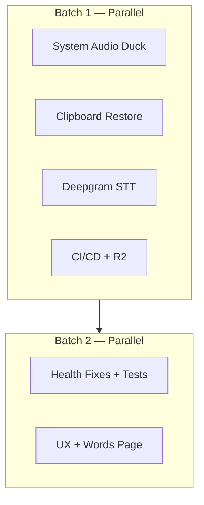

# Maverick Voice — Overall Improvements Implementation Plan

> **For agentic workers:** Use subagent-driven development. Each workstream below is designed for a separate subagent. Complete workstreams in dependency order where noted. Steps use checkbox (`- [ ]`) syntax for tracking.

**Goal:** Ship health-report fixes, two user-reported bugs (system audio bleed + clipboard double-paste), Deepgram STT, UX simplification, dictionary/vocabulary split, tests + PR CI, and a reliable local-mac → R2 release path.

**Architecture:** Six parallelizable workstreams with a shared contract spine (`shared/types.ts`, `shared/ipc.ts`, `INTERFACES.md`). Bugs and providers touch main process; UI work stays renderer-only. Release tooling is scripts + workflow docs — macOS signing stays local, GitHub runs quality gates + Windows builds only.

**Tech stack:** Electron 40, React 19, TypeScript, Swift native helpers (darwin), electron-builder, Cloudflare R2 (S3-compatible), Vitest (new).

---

## Table of contents

1. [Workstream map & subagent assignments](#1-workstream-map--subagent-assignments)
2. [Workstream A — System audio duck during recording](#2-workstream-a--system-audio-duck-during-recording)
3. [Workstream B — Clipboard restore after auto-paste](#3-workstream-b--clipboard-restore-after-auto-paste)
4. [Workstream C — Deepgram STT provider](#4-workstream-c--deepgram-stt-provider)
5. [Workstream D — Health report fixes](#5-workstream-d--health-report-fixes)
6. [Workstream E — UX simplification & dictionary split](#6-workstream-e--ux-simplification--dictionary-split)
7. [Workstream F — CI/CD, release & R2 upload](#7-workstream-f--cicd-release--r2-upload)
8. [Execution order & merge strategy](#8-execution-order--merge-strategy)
9. [Verification checklist](#9-verification-checklist)

---

## 1. Workstream map & subagent assignments

| ID | Workstream | Subagent focus | Depends on | Est. size |
|----|------------|----------------|------------|-----------|
| **A** | System audio duck | Native + sessionManager hooks | — | Medium |
| **B** | Clipboard restore | `clipboard.ts` + AGENTS.md | — | Small |
| **C** | Deepgram STT | Provider recipe + Settings | — | Medium |
| **D** | Health report fixes | Tests, CI, retry, updater, dead code | B (clipboard doc) | Large |
| **E** | UX simplification | Settings, Dictionary, Voice, nav | C optional | Large |
| **F** | CI/CD & R2 | Workflows, local release script | — | Medium |

**Recommended parallel batches:**

- **Batch 1 (parallel):** A, B, C, F
- **Batch 2 (parallel):** D, E (after Batch 1 merges or on separate branches)

---

## 2. Workstream A — System audio duck during recording

### Problem

Mic captures speaker output (YouTube, music, etc.) and pollutes STT. User wants system audio paused or muted for the recording window, then restored.

### Approach (recommended)

**Mute default system output device** via platform-native APIs — works for all apps (browser, Spotify, etc.), not just scriptable ones.

| Platform | Implementation |
|----------|----------------|
| **darwin** | Extend `globe-listener` (or new `audio-duck.swift` helper) with stdin commands `DUCK` / `UNDUCK`. Use CoreAudio: read default output device → save current mute state + volume → set mute ON → on UNDUCK restore prior state. |
| **win32** | New `electron/systemAudio.ts`: PowerShell/COM `IAudioEndpointVolume` on default render endpoint, or lightweight `nircmd`-free PowerShell script. Save mute state, mute, restore. |

**Secondary mitigation (renderer):** In `useAudioRecorder.ts`, add WebRTC constraints:

```ts
audio: {
  echoCancellation: true,
  noiseSuppression: true,
  autoGainControl: true,
  ...(deviceId ? { deviceId: { exact: deviceId } } : {}),
}
```

This helps but is **not sufficient alone** — keep native duck as primary.

### Settings

Add toggle in **Settings → Dictation**:

- `duckSystemAudioWhileRecording` (default: **true**)
- Persist in `electron-store` (same pattern as `chunkedTranscription`, `autoFormat`)

### Hook points

Call duck/unduck from `sessionManager.ts`:

| Event | Action |
|-------|--------|
| `startRecording()` / `chainSession()` after `setTrayRecording` | `systemAudio.duck()` if setting enabled |
| `stopRecording()` when sending `RECORDING_STOP` | `systemAudio.unduck()` |
| `discardSession()`, `cancelSession()`, session error paths | `systemAudio.unduck()` (idempotent) |
| Chain dictation → instruction | **Do not unduck** between chain segments; unduck only when session fully ends |

Use a ref-count or `duckGeneration` token so chained recordings don't restore audio mid-session.

### Files

| Action | Path |
|--------|------|
| Create | `electron/systemAudio.ts` |
| Modify | `electron/sessionManager.ts` — duck/unduck calls |
| Modify | `native/macos/globe-listener.swift` — `DUCK`/`UNDUCK` tokens (or new helper + `scripts/build-audio-duck.js`) |
| Modify | `electron/keyListener.ts` — expose `sendCommand('DUCK'|'UNDUCK')` on darwin |
| Modify | `shared/types.ts` — setting shape + `ElectronAPI` |
| Modify | `shared/ipc.ts` — `SET_DUCK_SYSTEM_AUDIO` / getter if needed |
| Modify | `electron/main.ts`, `electron/preload.ts` |
| Modify | `renderer/app/Settings.tsx` — toggle |
| Modify | `renderer/widget/useAudioRecorder.ts` — echo cancellation constraints |
| Modify | `AGENTS.md` — document duck behavior + ref-count rule |

### Tasks

- [ ] **A1:** Implement `systemAudio.duck()` / `unduck()` with saved-state restore (darwin Swift + win32 PowerShell)
- [ ] **A2:** Add setting + IPC + Settings toggle (default on)
- [ ] **A3:** Wire sessionManager with ref-count for chain sessions
- [ ] **A4:** Add echoCancellation constraints in `useAudioRecorder`
- [ ] **A5:** Manual test: YouTube playing → dictation → audio resumes after stop

---

## 3. Workstream B — Clipboard restore after auto-paste

### Problem

`injectOutput()` writes transcript to clipboard, auto-pastes, but **leaves transcript on clipboard**. User's prior copy is lost; manual Cmd+V pastes the transcript again.

### Desired behavior

```
1. Save current clipboard (text + optionally html/image if feasible — text-only OK for v1)
2. Write transcript to clipboard
3. Simulate Cmd/Ctrl+V
4. If auto-paste succeeds → RESTORE saved clipboard
5. If auto-paste fails → LEAVE transcript on clipboard (manual paste fallback)
```

### Implementation

Modify `electron/clipboard.ts` → `injectOutput`:

```ts
export async function injectOutput(text: string): Promise<void> {
  const savedClipboard = clipboard.readText()
  clipboard.writeText(text)
  try {
    await simulateKeyCombo('v', 'command')
    clipboard.writeText(savedClipboard) // restore on success
    console.log('[clipboard] Auto-paste succeeded; clipboard restored')
  } catch (err) {
    // transcript stays on clipboard for manual paste
    console.log('[clipboard] Auto-paste failed; transcript kept on clipboard')
  }
}
```

**Edge case:** If `savedClipboard === text` (user had same text copied), restore anyway — harmless.

**AGENTS.md / INTERFACES.md:** Update `injectOutput` behavioral note (restore on success).

### Files

| Action | Path |
|--------|------|
| Modify | `electron/clipboard.ts` |
| Modify | `AGENTS.md` §5 |
| Modify | `INTERFACES.md` clipboard section |
| Test | `electron/clipboard.test.ts` (mock electron.clipboard + simulateKeyCombo) |

### Tasks

- [ ] **B1:** Implement restore-on-success in `injectOutput`
- [ ] **B2:** Update AGENTS.md + INTERFACES.md
- [ ] **B3:** Unit test with mocked clipboard

---

## 4. Workstream C — Deepgram STT provider

Follow AGENTS.md §2 provider recipe exactly.

### API reference

- Endpoint: `POST https://api.deepgram.com/v1/listen`
- Auth: `Authorization: Token <key>`
- Body: multipart audio or raw bytes; query params: `model`, `language`, `punctuate=true`
- Models: `nova-3`, `nova-2`, `whisper-large` (verify current Deepgram model list)
- Prompt/keyterms: Deepgram supports `keyterm` / keyword boosting on newer models — map dictionary hint separately from Groq's `prompt` param

### Files (provider recipe)

| Step | Path |
|------|------|
| 1. Provider | `electron/providers/stt/deepgram.ts` — singleton implementing `TranscriptionProvider` |
| 2. Registry | `electron/providers/registry.ts` — `.set(deepgramProvider.id, deepgramProvider)` |
| 3. Union | `shared/types.ts` — `STTProviderId = 'groq' \| 'deepgram'` |
| 4. Pricing | `electron/config.ts` — `STT_PRICING` rows for Deepgram models |
| 5. Keys | `electron/keyStore.ts` — add `deepgram: 'DEEPGRAM_API_KEY'` to `ENV_VAR` |
| 6. Types | `shared/types.ts` — extend `ProviderId` |
| 7. Settings UI | `renderer/app/Settings.tsx` — STT provider picker + model list + key field |
| 8. Icons | Optional Deepgram icon in Settings (or generic label) |

### Provider invariants

- Empty key → `NoApiKeyError('deepgram')`
- Re-throw `AbortError`
- `recordSttUsage(model, durationSeconds)` with exact model string
- Dictionary hint: use Deepgram's keyword/keyterm API if supported; else skip hint (document in provider file)

### Tasks

- [ ] **C1:** Create `deepgram.ts` provider with `transcribe`, `testKey`, models list
- [ ] **C2:** Register + types + pricing + keyStore
- [ ] **C3:** Settings UI — STT provider dropdown, key management (mirror Groq pattern)
- [ ] **C4:** Verify `sessionManager` and retry path use registry (no Groq hardcoding)
- [ ] **C5:** Update README Features list

---

## 5. Workstream D — Health report fixes

### D1 — Quick UX copy fix

| File | Change |
|------|--------|
| `renderer/app/Voice.tsx` | Replace "Right Shift" → "Caps Lock"; note instruction mode is opt-in (Settings → Advanced) |

### D2 — PR CI workflow (no signing)

Create `.github/workflows/ci.yml`:

```yaml
on: [push, pull_request]
jobs:
  typecheck-and-build:
    runs-on: ubuntu-latest  # or macos-latest without native compile requirement
    steps:
      - checkout
      - setup-node 20
      - npm ci
      - npm run typecheck
      - npm run build
```

Note: `compile:native` is no-op off darwin; CI validates TS + Vite bundle without spawning key listeners.

### D3 — Unit tests (Vitest)

Add devDependency `vitest`. Create `vitest.config.ts` targeting pure functions:

| Test file | Functions |
|-----------|-----------|
| `electron/sessionManager.test.ts` | `cleanTranscript`, `applyDictionary`, `applySnippets`, `buildSttPromptHint` (export hint builder or test via dictionary entries) |
| `electron/clipboard.test.ts` | `injectOutput` restore behavior |

Add script: `"test": "vitest run"`, wire into CI after typecheck.

Export `buildSttPromptHint` from `sessionManager.ts` if needed for testing (or test indirectly through `applyDictionary` + hint integration test).

### D4 — History retry pipeline parity

Modify `electron/main.ts` → `retrySessionFromAudio`:

After STT + `cleanTranscript`, run the same post-STT path as live sessions:

```
cleanTranscript → applyDictionary → applySnippets → (optional autoFormat if enabled)
```

Import `applyDictionary`, `applySnippets` from `sessionManager`. Load dictionary/snippets from store (already in `restoreSettings`). Pass `buildSttPromptHint` to STT on re-transcribe.

Preserve original session `flowType` when retrying instruction sessions (don't force `dictation`).

### D5 — Auto-updater decision

**Recommended:** Wire updater to real URL, not remove.

| File | Change |
|------|--------|
| `electron/updater.ts` | Read `FEED_URL` from env at build time: `process.env.R2_PUBLIC_URL + '/releases'` or electron-store |
| `package.json` `build.publish.url` | Same — use env var in electron-builder config or `scripts/inject-publish-url.js` pre-build |
| Document | If `R2_PUBLIC_URL` unset in packaged build, skip updater init |

Resolve AGENTS.md §9 conflict by updating §9 to say updater is allowed when R2 feed is configured.

### D6 — Error log Developer UI

| File | Change |
|------|--------|
| `electron/preload.ts` | Expose `onDevErrorLog(callback)` |
| `renderer/app/Settings.tsx` | Collapsible "Developer" section — scrollable error list (last 50) |
| `shared/types.ts` + `shared/ipc.ts` | Add getter `getErrorLog()` if needed for initial load |

### D7 — Dead code cleanup

| Item | Action |
|------|--------|
| `native/macos/key-poster.swift` + build script | Remove OR document as unused; stop compiling in `compile:native` if removed |
| `keyListener.sendCommand('PASTE'/'COPY')` | Remove if unused, or document darwin-only legacy |

**Do not remove** if Workstream A extends `globe-listener` instead.

### D8 — Misc doc sync

- `INTERFACES.md` — default LLM = Groq `llama-3.3-70b-versatile` (match `main.ts`)
- `renderer/app/Privacy.tsx` — mention Groq for STT + optional Groq LLM
- Wire `scripts/check-native.js` into `predev` / `prebuild` (fail with clear message if globe-listener missing on darwin)

### D9 — Renderer IPC import cleanup (optional)

Replace `shared/ipc.ts` imports in `WidgetApp.tsx` / `History.tsx` with documented literal strings per AGENTS.md renderer exception — low priority.

### Tasks

- [ ] **D1:** Voice.tsx Caps Lock fix
- [ ] **D2:** ci.yml
- [ ] **D3:** Vitest + pipeline tests
- [ ] **D4:** Retry pipeline parity
- [ ] **D5:** Updater URL from R2_PUBLIC_URL
- [ ] **D6:** Developer error log UI
- [ ] **D7:** Dead code cleanup
- [ ] **D8:** Doc sync + check-native wiring

---

## 6. Workstream E — UX simplification & dictionary split

### Problem

Settings is ~1,257 lines with many sections. Dictionary mixes replacements and vocabulary in one list (though data model already supports optional `to`).

### E1 — Settings simplification

**Target IA (information architecture):**

| Tab / Section | Contents |
|---------------|----------|
| **Essentials** | Mic device, dictation key, activation mode, STT provider + key, duck audio toggle |
| **AI (optional)** | LLM provider, model, keys, auto-format toggle, instruction mode toggle |
| **Shortcuts** | Combo bindings (collapsed by default) |
| **Data** | History retention (new), export dictionary/snippets |
| **About** | Usage stats, Privacy, Developer |

**Implementation:**

- Split `Settings.tsx` into subcomponents: `SettingsEssentials.tsx`, `SettingsAI.tsx`, `SettingsShortcuts.tsx`, `SettingsData.tsx`
- Use accordion / collapsible sections — **Essentials expanded**, Advanced collapsed
- Move Usage + Privacy blocks (already partially merged) under About
- Reduce visual density: fewer borders, combine related toggles

### E2 — Nav simplification

Current sidebar: Home, History, Dictionary, Snippets, Settings (5 tabs).

**Proposed:**

| Nav item | Contents |
|----------|----------|
| **Home** | Quick start + caps lock hint (fixed copy) |
| **History** | Unchanged |
| **Words** | Combined Dictionary + Snippets with sub-tabs: **Replacements**, **Vocabulary**, **Snippets** |
| **Settings** | Simplified per E1 |

Remove separate Dictionary + Snippets nav entries → one **Words** page.

### E3 — Dictionary / Vocabulary split (UI only)

**Data model:** Keep single `DictionaryEntry[]` in store — no migration needed.

| UI tab | `DictionaryEntry` shape | Behavior |
|--------|-------------------------|----------|
| **Replacements** | `{ from, to }` required | Shown in list; `applyDictionary` replaces |
| **Vocabulary** | `{ from, to: undefined }` | Names/terms; STT hint only via `buildSttPromptHint` |

Filter entries in UI by `entry.to !== undefined` vs `entry.to === undefined`.

Improve copy:

- Replacements: "Fix what the AI mishears"
- Vocabulary: "Names and terms the AI should recognize (no text replacement)"
- Snippets: "Short triggers that expand to longer text"

Optional: add `kind: 'replacement' | 'vocabulary'` field later for clarity — **not required for v1** if UI filters on `to`.

### E4 — Onboarding improvements

- Step: Groq/Deepgram API key entry (link to provider dashboard)
- Explain dictation vs instruction vs auto-format in one screen
- Mention duck-system-audio setting

### Files

| Action | Path |
|--------|------|
| Create | `renderer/app/words/WordsPage.tsx`, `ReplacementsTab.tsx`, `VocabularyTab.tsx` |
| Modify | `renderer/app/App.tsx` — nav: `words` tab replaces dictionary + snippets |
| Refactor | `renderer/app/Settings.tsx` → split components |
| Modify | `renderer/app/Onboarding.tsx` |
| Deprecate | `Dictionary.tsx`, `Snippets.tsx` — merge into Words page or re-export |

### Tasks

- [ ] **E1:** Split Settings into collapsible sections
- [ ] **E2:** Merge nav → Words page with 3 sub-tabs
- [ ] **E3:** Vocabulary vs Replacements UI + copy
- [ ] **E4:** Onboarding key setup step
- [ ] **E5:** Remove/update stale Voice.tsx content (coordinate with D1)

---

## 7. Workstream F — CI/CD, release & R2 upload

### Current state

- `.github/workflows/release.yml` — self-hosted Mac + `windows-latest`
- Mac signing fails on GitHub (user runs locally) — **expected**
- `upload-r2.mjs` runs in CI but user says **DMG doesn't reach R2** when building locally
- `package.json` publish URL is placeholder: `REPLACE_WITH_YOUR_R2_PUBLIC_URL`

### Root causes (likely)

1. Local `npm run dist:mac` doesn't run `upload-r2.mjs` afterward
2. R2 env vars not loaded locally (only in GitHub secrets)
3. `release:mac` uses `--publish always` but placeholder URL breaks `latest-mac.yml` generation
4. Self-hosted runner may lack R2 secrets or `release/` artifacts after failed sign step

### F1 — Local release script

Create `scripts/release-mac-local.sh`:

```bash
#!/usr/bin/env bash
set -euo pipefail
# Load .env.release if present (R2_*, APPLE_*)
npm run dist:mac
node scripts/upload-r2.mjs
echo "Done. Verify: $R2_PUBLIC_URL/downloads.json"
```

Create `.env.release.example`:

```
R2_ACCESS_KEY_ID=
R2_SECRET_ACCESS_KEY=
R2_ENDPOINT=https://<account>.r2.cloudflarestorage.com
R2_BUCKET_NAME=maverick-voice
R2_PUBLIC_URL=https://pub-xxxxx.r2.dev
APPLE_ID=
APPLE_APP_SPECIFIC_PASSWORD=
APPLE_TEAM_ID=
```

Add npm script: `"release:mac:upload": "npm run dist:mac && node scripts/upload-r2.mjs"`

### F2 — Fix upload-r2.mjs

Enhancements:

- Log bucket, endpoint (redacted), file count
- Upload `downloads.json` even when only mac artifacts present (win optional)
- Support `RELEASE_DIR` override
- Exit non-zero with actionable message if credentials missing
- Optionally upload `latest-mac.yml` required by electron-updater

Verify artifact names match electron-builder output: `Maverick Voice-${version}-arm64.dmg`

### F3 — Split GitHub workflows

| Workflow | Trigger | Runner | Purpose |
|----------|---------|--------|---------|
| `ci.yml` | push, PR | ubuntu | typecheck + build + test |
| `release-win.yml` | tag `v*.*.*` | windows-latest | build NSIS + upload R2 |
| `release-mac.yml` | **disabled** or `workflow_dispatch` only | self-hosted | optional; document as fallback |

Update `release.yml`:

- Add `continue-on-error` docs OR remove mac job entirely
- Add comment block: **"Mac builds: run `npm run release:mac:upload` locally"**

### F4 — Publish URL injection

`electron-builder` needs real URL for `latest-mac.yml`:

Option A — env in `package.json`:

```json
"publish": {
  "provider": "generic",
  "url": "${env.R2_PUBLIC_URL}/releases"
}
```

Option B — `scripts/prebuild-publish.js` writes publish config from env.

Wire `electron/updater.ts` FEED_URL to same source.

### F5 — Documentation

Add `docs/RELEASE.md`:

1. Bump version: `npm version patch`
2. Local mac: `source .env.release && npm run release:mac:upload`
3. Windows: tag push triggers CI OR local `dist:win` + upload
4. Verify: curl `$R2_PUBLIC_URL/downloads.json`
5. GitHub secrets list for CI

### Tasks

- [ ] **F1:** `release-mac-local.sh` + `.env.release.example` + npm script
- [ ] **F2:** Harden `upload-r2.mjs`
- [ ] **F3:** Split workflows; mac local-only documented
- [ ] **F4:** Inject R2_PUBLIC_URL into publish config + updater
- [ ] **F5:** RELEASE.md

---

## 8. Execution order & merge strategy



**Branch strategy:**

- `feat/system-audio-duck`
- `feat/clipboard-restore`
- `feat/deepgram-stt`
- `feat/ci-r2-release`
- `feat/health-fixes` (depends on clipboard branch)
- `feat/ux-words-settings`

Merge to `main` in order: B → A → C → F → D → E (resolve conflicts in Settings last).

---

## 9. Verification checklist

Before claiming complete, each workstream must verify:

| Check | Command / action |
|-------|------------------|
| Typecheck | `npm run typecheck` |
| Build | `npm run build` |
| Tests | `npm run test` |
| No dev hang | Do NOT run `npm run dev` in CI |
| Manual: duck audio | YouTube playing → record → audio muted → stops → audio back |
| Manual: clipboard | Copy "hello" → dictate → auto-paste → Cmd+V pastes "hello" not transcript |
| Manual: Deepgram | Set Deepgram key → transcribe successfully |
| Manual: Words UI | Add vocabulary-only entry → appears in STT hint, no replacement |
| Manual: R2 | Local release script → `downloads.json` updates → DMG downloadable |

---

## Appendix — File touch summary

| Path | Workstreams |
|------|-------------|
| `electron/systemAudio.ts` | A |
| `electron/clipboard.ts` | B |
| `electron/providers/stt/deepgram.ts` | C |
| `electron/sessionManager.ts` | A, D |
| `electron/main.ts` | A, C, D |
| `electron/updater.ts` | D, F |
| `scripts/upload-r2.mjs` | F |
| `.github/workflows/ci.yml` | D, F |
| `renderer/app/Settings.tsx` | A, C, D, E |
| `renderer/app/words/*` | E |
| `renderer/app/Voice.tsx` | D, E |
| `shared/types.ts` | A, C, D |
| `shared/ipc.ts` | A, C, D |
| `AGENTS.md` | A, B, D, F |

---

*Plan authored 2026-06-14. Ready for subagent execution.*
